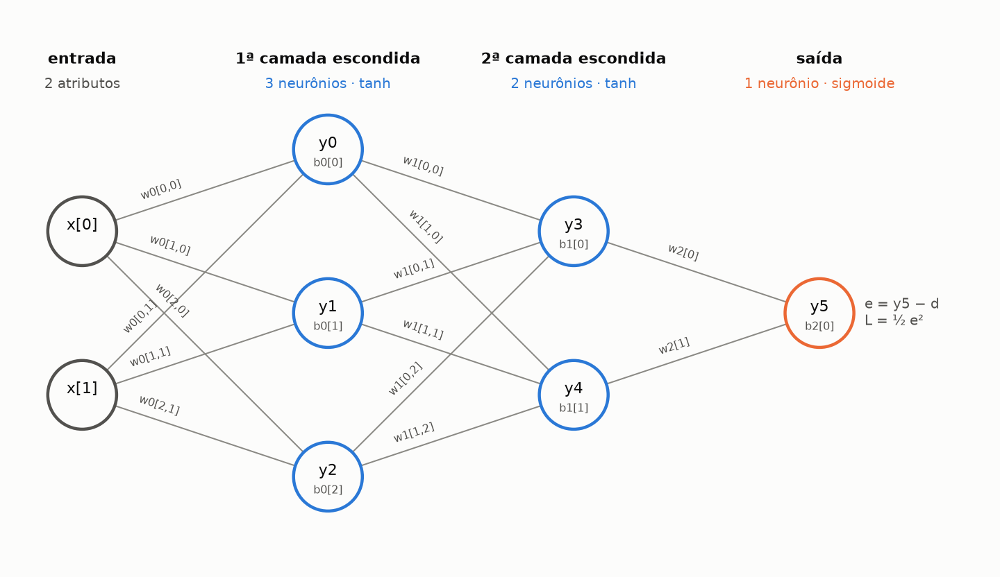
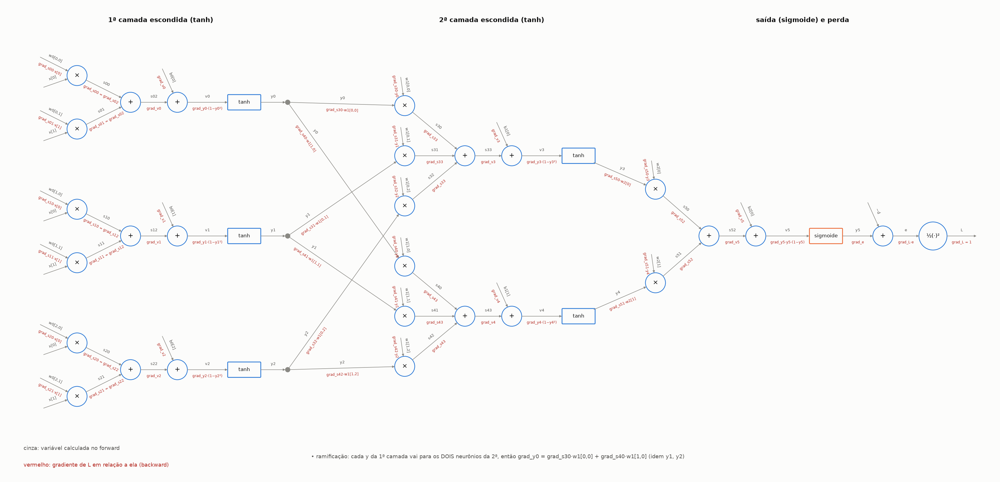

# Projeto 1: Rede Neural (modificação do exemplo da aula)

**Disciplina:** Matemática para Ciência de Dados, Pós-graduação em ML, UFPE
**Professor:** Adenilton José da Silva

Partimos do arquivo `rede_neural.py` apresentado em aula (rede **2 → 2 → 1** com sigmoide, forward e backward escritos à mão e comparação com Keras). Mantivemos o mesmo esqueleto e a mesma forma de implementar, **"hardcoded"**: cada soma, multiplicação e derivada é uma linha de código. As modificações foram:

| | Original | Modificado |
|---|---|---|
| Arquitetura | 2 → 2 → 1 | **2 → 3 → 2 → 1** |
| Camadas escondidas | 1 | **2** (uma camada a mais) |
| Neurônios escondidos | 2 | **3 e 2** (um neurônio a mais na 1ª camada) |
| Ativação das camadas escondidas | sigmoide | **tangente hiperbólica (tanh)** |
| Ativação da saída | sigmoide | sigmoide (mantida, porque a classe é 0 ou 1) |
| Pesos treináveis | 9 | 20 |
| Keras | arquitetura diferente (5 relu → 5 tanh → 1), treinado à parte | **mesma arquitetura, mesmos pesos iniciais e mesmo passo de gradiente**, com comparação dos pesos finais |

Base de dados, função de perda (`L = ½e²`), inicialização (`np.random.rand`), taxa de aprendizado (0,1) e número de iterações (10.000) ficaram iguais ao original, para que a diferença de resultado venha só das modificações.

## 1. Arquitetura da rede



Os neurônios são numerados em sequência: **0, 1, 2** na 1ª camada escondida, **3, 4** na 2ª e **5** na saída. Os pesos seguem a organização da aula, uma matriz por camada, com linha = neurônio e coluna = entrada:

| Parâmetro | Formato | Liga |
|---|---|---|
| `w0`, `b0` | 3×2, 3 | entradas → 1ª camada escondida |
| `w1`, `b1` | 2×3, 2 | 1ª → 2ª camada escondida |
| `w2`, `b2` | 2, 1 | 2ª camada escondida → saída |

## 2. Grafo de computação



Em cinza está o nome de cada variável calculada no forward. Em vermelho está o gradiente da perda em relação a ela, calculado no backward. Os nomes são os mesmos do código (`s00`, `v0`, `y0`, `grad_s00`…).

### Forward (neurônio 0 da 1ª camada, neurônio 3 da 2ª e saída)

```
s00 = w0[0,0]·x[0]     s01 = w0[0,1]·x[1]     s02 = s00 + s01     v0 = s02 + b0[0]     y0 = tanh(v0)
s30 = w1[0,0]·y0       s31 = w1[0,1]·y1       s32 = w1[0,2]·y2    s33 = s30 + s31 + s32
v3  = s33 + b1[0]      y3  = tanh(v3)
s50 = w2[0]·y3         s51 = w2[1]·y4         s52 = s50 + s51     v5 = s52 + b2[0]     y5 = sigmoide(v5)
e   = y5 − d           L   = ½ e²
```

### Backward

Usamos as mesmas regras da aula: a soma distribui o gradiente e a multiplicação troca (o gradiente de um fator é o gradiente do produto vezes o outro fator).

```
grad_e  = e
grad_v5 = grad_e · y5·(1 − y5)                  ← derivada da sigmoide
grad_w2[0] = grad_v5 · y3                         grad_y3 = grad_v5 · w2[0]
grad_v3 = grad_y3 · (1 − y3²)                     ← derivada da tanh
grad_w1[0,j] = grad_v3 · yj                       grad_b1[0] = grad_v3
grad_y0 = grad_v3·w1[0,0] + grad_v4·w1[1,0]       ← y0 alimenta DOIS neurônios: soma
grad_v0 = grad_y0 · (1 − y0²)
grad_w0[0,i] = grad_v0 · x[i]                     grad_b0[0] = grad_v0
```

A derivada da tanh sai em função da própria saída, como a da sigmoide no original: `d tanh(v)/dv = 1 − tanh(v)² = 1 − y²`.

## 3. Código rodando e comparação com o Keras

```
$ python rede_neural.py
50 acurácia antes do treinamento
0 16.38272877257388
1000 0.0035027128863068338
...
9000 0.000176123354764967
acc 100
acc keras 100
maior diferença entre os pesos finais (manual x keras): 2.5081986265718115e-08
```

Execução completa em cerca de 40 s. A rede manual e o Keras acertam os 100 pontos. Como os dois partem dos mesmos pesos e dão os mesmos passos, os **pesos finais coincidem até a 8ª casa decimal**, o que confirma que a implementação manual calcula o mesmo que o Keras.

Para as duas redes serem comparáveis passo a passo:
- **Mesmos pesos iniciais:** os pesos sorteados para a rede manual são copiados para o Keras com `set_weights`, transpostos, porque o Keras guarda a matriz como (entradas × neurônios).
- **Mesmo passo:** a rede manual soma o gradiente de `½e²` nos 100 exemplos e usa taxa 0,1. O `mean_squared_error` do Keras é a média de `e²`, com derivada `2e/100`. Para os passos serem iguais, a taxa do Keras precisa ser `0,1 × 100 / 2 = 5`.
- **Mesmo lote:** a base inteira a cada passo (`batch_size=100`), sem embaralhar, por 10.000 passos.
- **Mesma precisão:** o Keras é configurado em `float64`, como o NumPy.

### Original × modificado

Mesmos dados e mesmos pesos sorteados (sementes 0 a 4 do NumPy); acurácia nos 100 pontos de treino, como no código original:

| Semente | 0 | 1 | 2 | 3 | 4 | Média |
|---|---|---|---|---|---|---|
| Original 2-2-1 sigmoide | 91% | 87% | 89% | 90% | 89% | **89,2%** |
| Modificado 2-3-2-1 tanh | 100% | 100% | 100% | 100% | 100% | **100%** |

A perda total na iteração 9.000 cai de 3,5–4,5 no original para 0,0002–0,0003 na rede modificada.

### Verificação do backward

`verifica_gradiente.py` compara cada gradiente calculado por `neural_net()` com a derivada numérica `(L(w+h) − L(w−h)) / 2h`, em 20 exemplos aleatórios. O maior erro relativo foi **1,8e-6** (em `w0`), ou seja, o backward escrito à mão está correto.

## Dificuldades encontradas

1. **O gradiente de quem alimenta mais de um neurônio é uma soma.** No original, cada `y` da camada escondida vai para um único neurônio, então `grad_y0 = grad_v2 · w1[0]`. Com a 2ª camada, `y0` alimenta os neurônios 3 **e** 4, e o gradiente dele é a soma do que volta pelos dois caminhos: `grad_y0 = grad_s30·w1[0,0] + grad_s40·w1[1,0]`. Foi o ponto que mais exigiu atenção no grafo. Se só um dos termos for usado, o código roda sem erro nenhum e o problema passa despercebido. Por isso escrevemos a verificação numérica.

2. **Tamanho do código.** Com 20 pesos no lugar de 9, o forward e o backward "hardcoded" ficaram bem mais longos (o forward aparece duas vezes, em `run_neural_net` e `neural_net`, como no original), e é fácil trocar um índice (`w1[1,0]` por `w1[0,1]`). Numerar os neurônios em sequência (0 a 5) e usar esses números nos nomes (`s30`, `s41`…) ajudou a manter o código e o grafo coerentes.

3. **Taxa de aprendizado equivalente no Keras.** Com a mesma taxa 0,1 nas duas redes, o Keras daria passos 50 vezes menores, porque a rede manual **soma** o gradiente de `½e²`, enquanto o Keras faz a **média** de `e²` (derivada `2e/N`). A taxa equivalente é `0,1 × 100 / 2 = 5`.

4. **Pesos transpostos.** O `set_weights` do Keras espera cada matriz como (entradas × neurônios), e o nosso `w0[j, i]` é (neurônios × entradas). Sem transpor, o Keras recusa as matrizes 3×2 e 2×3 por erro de formato; numa matriz quadrada, como a 2×2 do original, os pesos seriam trocados sem nenhum aviso.

5. **Diferença de precisão.** Mesmo com tudo igual, os pesos finais diferiam entre 0,02 e 0,1 (conforme a semente) com o Keras no padrão `float32`. Para descobrir se era erro de conta ou de precisão, comparamos após **um único passo** em `float64`: diferença de 2,8e-16, o limite da máquina. Então as contas são iguais, e a diferença vem de arredondamento que se acumula em 10.000 passos, com os passos grandes do início amplificando os erros (a perda começa em 16). Com o Keras em `float64`, a diferença final caiu para 2,5e-8.

6. **Keras lento com 10.000 épocas.** `model.fit(..., epochs=10000)` levou cerca de 10 minutos, porque cada época tem um custo fixo no Keras. A solução foi repetir a base 10.000 vezes (`np.tile`), sem embaralhar, e treinar 1 época com lotes de 100. Cada lote é exatamente a base inteira, então os passos são idênticos, e o tempo caiu para cerca de 12 segundos.

7. **Instalação do TensorFlow no Windows.** A primeira importação falhou com *"O arquivo de paginação é muito pequeno para que esta operação seja concluída"*: faltou memória virtual para carregar as DLLs do TensorFlow enquanto outros treinos rodavam em paralelo. Com a máquina livre, carregou normalmente.

8. **Tempo de treino da rede manual.** Como tudo é Python puro, exemplo a exemplo, o treino passou de ~20–30 s para ~40 s. Isso reforça o que foi dito em aula sobre usar bases pequenas nessa implementação.

9. **Acurácia medida no treino.** Mantivemos a avaliação do original, nos mesmos 100 pontos usados para treinar. Os 100% mostram que a rede consegue separar as luas, mas não medem generalização; para isso seria preciso separar um conjunto de teste.

## Como executar

```bash
python -m venv .venv
# Windows: .venv\Scripts\activate    |    Linux/Mac: source .venv/bin/activate
pip install -r requirements.txt

python rede_neural.py          # treina a rede manual e o Keras (~40 s)
python verifica_gradiente.py   # confere o backward com diferenças finitas
python gera_figuras.py         # recria as figuras de arquitetura e do grafo
```

## Arquivos

| Arquivo | Conteúdo |
|---|---|
| `rede_neural.py` | Rede modificada (esqueleto da aula) + comparação com Keras |
| `verifica_gradiente.py` | Verificação numérica do backward |
| `gera_figuras.py` | Gera `figuras/arquitetura.png` e `figuras/grafo_computacional.png` |

A versão original do `rede_neural.py` está no primeiro commit do histórico.

## Integrantes

- _(preencher)_
